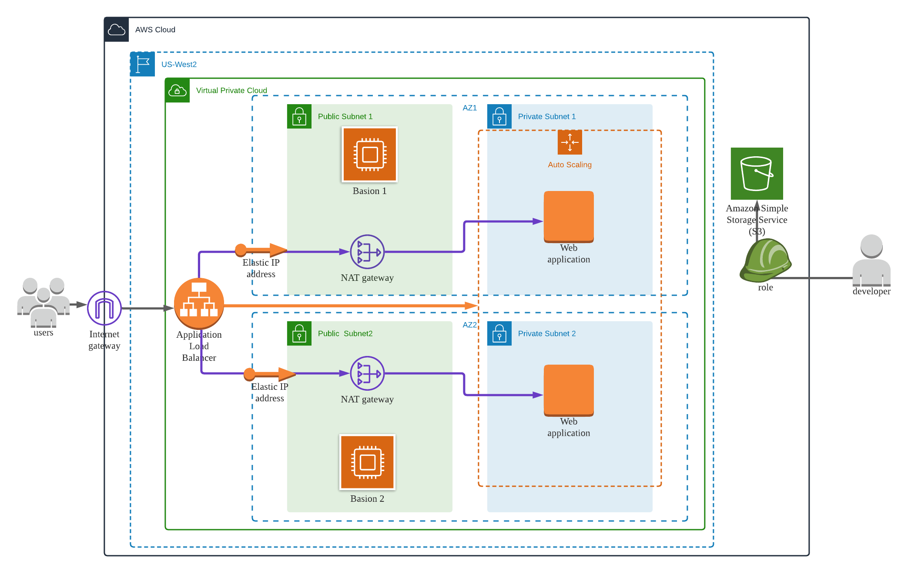

# Deploy a high-availability web app using CloudFormation  

deploy an application" Udagram" (Apache Web Server) and you also pick up code (JavaScript and HTML) from S3 Storage and deploy it in the appropriate folder on the web server.

1. develop a diagram that you can present as a visual aid to understand the CloudFormation script.

2. The second part is to interpret the instructions as well as diagram and create a matching CloudFormation script.

## diagram

## reqirement
-  application servers in order to deploy four servers, two located in each of your private subnets.
-   The launch configuration will be used by an auto-scaling group.  
-   two vCPUs and at least 4GB of RAM. The Operating System to be used is Ubuntu 18.  
-   to allocate at least 10GB of disk space 
-   
-   downloading the application archive from an S3 Bucket, need to create an IAM Role that allows your instances to use the S3 Service.
-   Udagram communicates on the default HTTP Port: 80, so servers will need this inbound port open since you will use it with the Load Balancer and the Load Balancer Health Check. for outbound, the servers will need unrestricted internet access to be able to download and update its software.
-   The application needs to be deployed into private subnets with a Load Balancer located in a public subnet. 
-   The load balancer should allow all public traffic (0.0.0.0/0) on port 80 inbound, which is the default HTTP port. Outbound, it will only be using port 80 to reach the internal servers.
-   deploy your servers(bastion host) with an SSH Key into Public subnets and also need the SSH port open (port 22) for your access.

-   Log information for UserData scripts is located in this file: cloud-init-output.log under the folder: /var/log.

## deployment step
Deployed following two steps by aws CLI 

- network  
  >aws cloudformation create-stack --stack-name network  --template-body file://network.yml  --parameters file://network-parameters.json --capabilities "CAPABILITY_IAM" "CAPABILITY_NAMED_IAM" --region=us-west-2   

- server
    >aws cloudformation create-stack --stack-name server  --template-body file://server.yml  --parameters file://server-parameters.json --capabilities "CAPABILITY_IAM" "CAPABILITY_NAMED_IAM" --region=us-west-2

## udagram

http://serve-webap-1mddyk2a2c27c-211130061.us-west-2.elb.amazonaws.com/

